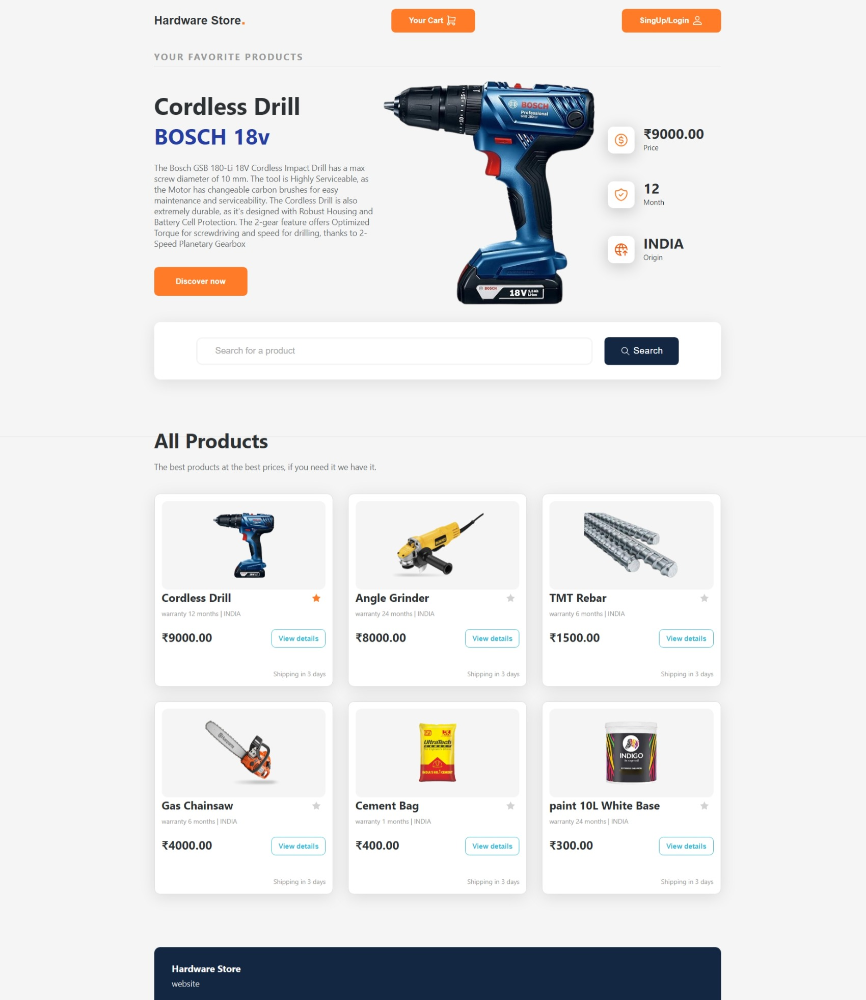
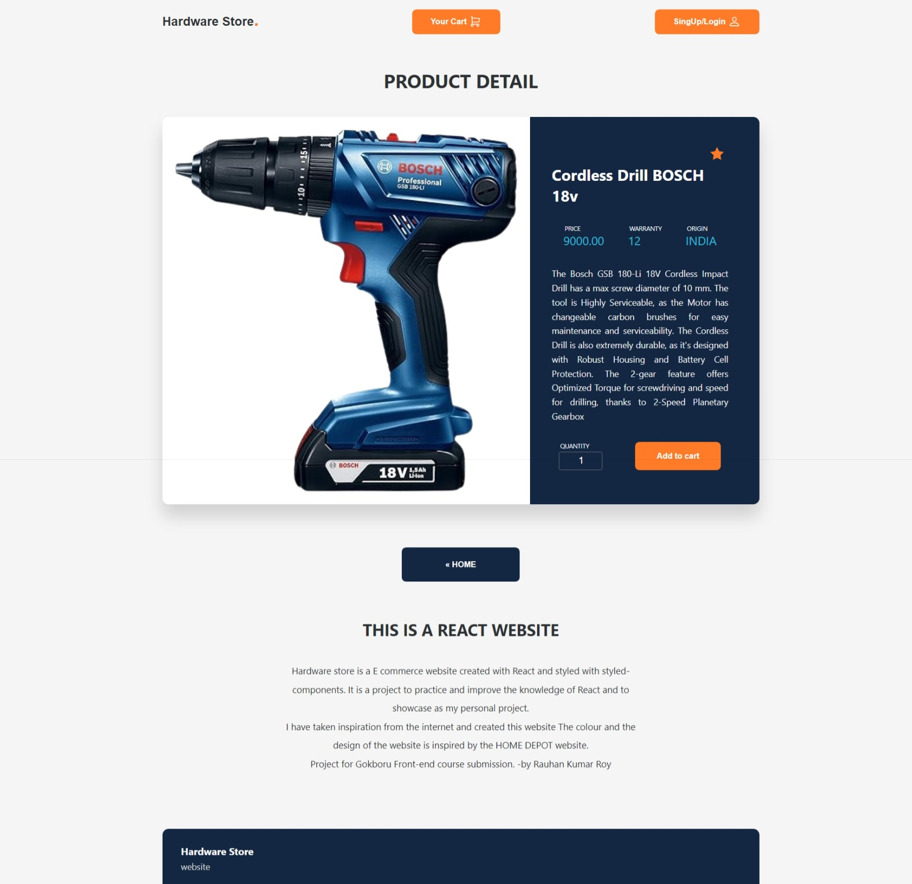
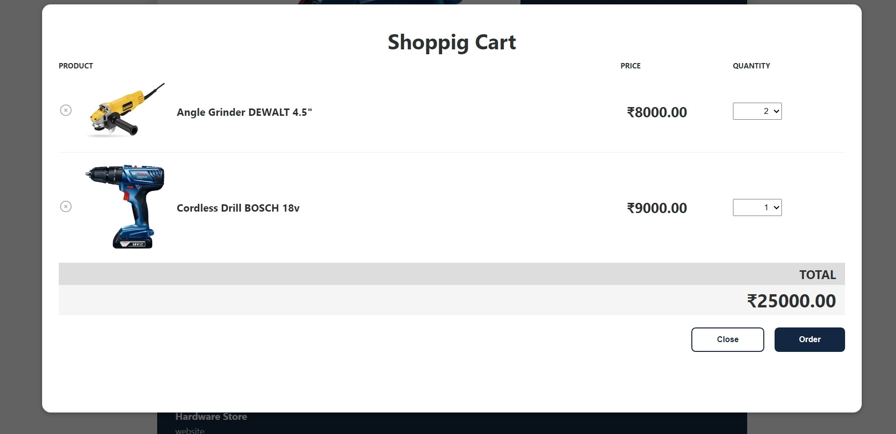

# Hardware Store



## Overview

Hardware Store is a web application built using React that allows users to browse, search, and purchase hardware products. The application features a user-friendly interface, a login/signup system, and a shopping cart functionality.

## Features

- **Product Listing**: Browse through a list of available hardware products.
- **Search Functionality**: Search for products by name or category.
- **User Authentication**: Login and signup functionality for users.
- **Shopping Cart**: Add products to the cart and proceed to checkout.
- **Responsive Design**: Optimized for both desktop and mobile devices.

## Installation

To run this project locally, follow these steps:

1. **Clone the repository**:
    ```bash
    git clone https://github.com/your-username/hardware-store.git
    cd hardware-store
    ```

2. **Install dependencies**:
    ```bash
    npm install
    ```

3. **Start the development server**:
    ```bash
    npm start
    ```

The application will be available at `http://localhost:3000`.

## Usage

- **Browse Products**: Navigate through the product listings.
- **Search Products**: Use the search bar to find specific products.
- **Add to Cart**: Add desired products to your shopping cart.
- **Checkout**: Review your cart and proceed to checkout.

## Project Structure
.
.
